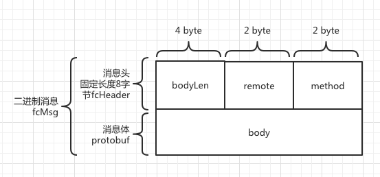

## jprotobuf

在阅读源码期间，偶然发现baidu的开源项目 [jprotobuf](!https://github.com/jhunters/jprotobuf) ，
其主要的优势就是不需要再编写`.proto`的文件的直接在pojo类上加上注解即可，
一定程度的简化了我们开发的流程提高的开发效率。但我个人观点还是需要`.proto`文件的，
即便没有此文件也需要通过文档的形式列出所有通讯消息的结构体。随时时间的推移项目的迭代以及各种跨平台的客户端的开发，有一份清晰的文档往往事半功倍，这也算是我个人的小小偏执吧。

(自定义消息)

## RSA/AES

数据的加密解密必然会带来额外的开销，至于是否采用加密取决于数据的敏感性，如果涉及用户隐私，如个人信息，交易记录等信息还是有必要的。

1. RSA,密钥长度1024, 填充方式PKCS1,公钥加密，私钥解密，公钥可通过私钥生成
2. AES使用AES/ECB/PKCS7Padding

###RSA加密
- RSA加密规则:若密钥位数是key_size, 单次加密串的最大长度为 (key_size)/8 - 11, 目前位数1024, 则最大加密长度为117，为了方便这里我们选择一次加密长度为100
- 将明文数据分成一个或数个最长100字节的小段进行加密，拼接分段加密数据即为最终的Body加密数据
###RSA解密
- RSA解密同样遵循分段规则，对于1024位密钥, 每小段待解密数据长度为128字节
- 将密文数据分成一个或数个128字节长的小段进行解密，拼接分段解密数据即为最终的Body解密数据

###AES加密

- AES加密要求源数据长度必须是16的整数倍, 故需补‘0’对齐后再加密，记录modlen为源数据长度与16取模值
- 因加密前有可能对源数据作修改， 故需在加密后的数据尾再增加一个16字节的填充数据块，其最后一个字节赋录modlen, 其余字节赋值‘0’， 将加密数据和额外的填充数据块拼接作为最终要发送协议的body数据

###AES解密
- 协议body数据, 先将最后一个字节取出，记录modlen， 然后将body截掉尾部16字节填充数据块后再解密（与加密填充额外数据块逻辑对应）
- modlen 为0时，上述解密后的数据即为协议返回的body数据, 否则需截掉尾部(16 - 录modlen)长度的用于填充对齐的数据
